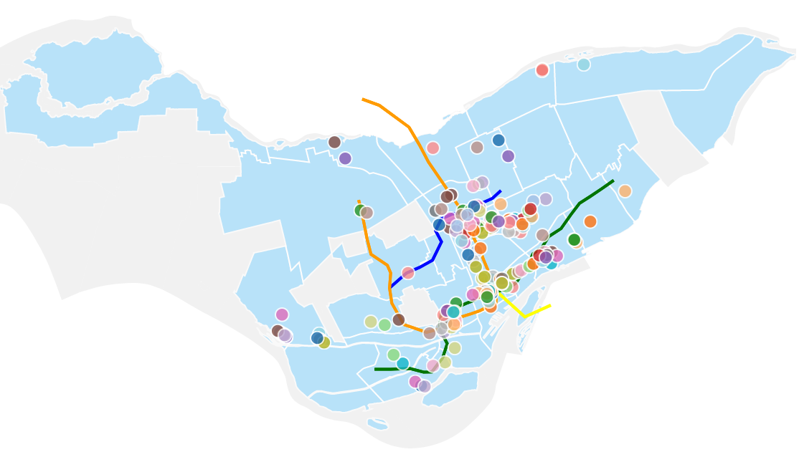

As a web developer with a background in GIS, cartography and engineering - I love interactive maps. Especially interactive maps build from open data!



[Montreal's Murals](https://vernl.github.io/p-mtl-murals/) is a side project I created using D3. The project uses a variety of data sets from [Montreal's Open Data Portal](http://donnees.ville.montreal.qc.ca/).

I created a simple loader to streamline the process of adding and removing data.

```javascript

  const geojsonFiles = [{name: 'neighbourhoods', path: './data/quartierssociologiques2014.geojson', geojson: ""},
                        {name: 'adminRegions', path: './data/limadmin.geojson', geojson: ""},
                        {name: 'subways', path: './data/stm.geojson', geojson: ""},
                        {name: 'murals', path: './data/murals.geojson', geojson: ""}]

  loadGeojsonFilesAndRunMain()

  function loadGeojsonFilesAndRunMain () {
    let q = d3.queue()
    for (let file of geojsonFiles){
      q.defer(d3.json, file.path)
    }
    q.awaitAll((err, files) => {
      if (err) {
        throw err
      } else {
        loadGeojsonFiles(files)
        main()
      }
    })
  }

  function loadGeojsonFiles(files) {
    geojsonFiles.map((file, i) => file.geojson = files[i])
    console.log(geojsonFiles[3].geojson.features)
  }

``` 

One of the challenges was creating a user friendly experience for map navigation. Features that are taken for granted in specialized libraries such as leaflet need to be programmed explicitly in D3. For example, the code for panning and zooming and scaling map elements is presented below. 

```javascript

const zoom = d3.zoom()
      .scaleExtent([1, 8])
      .on("zoom", zoomed)

    svg
      .call(zoom)

    function zoomed(){
      g.attr("transform", d3.event.transform)

      g
        .selectAll('.mural')
        .attr('r', 8 / (d3.event.transform.k) + 'px')

      }

```

This project was a lot of fun and I plan to improve the UI and expand on the base functionality at a later date.