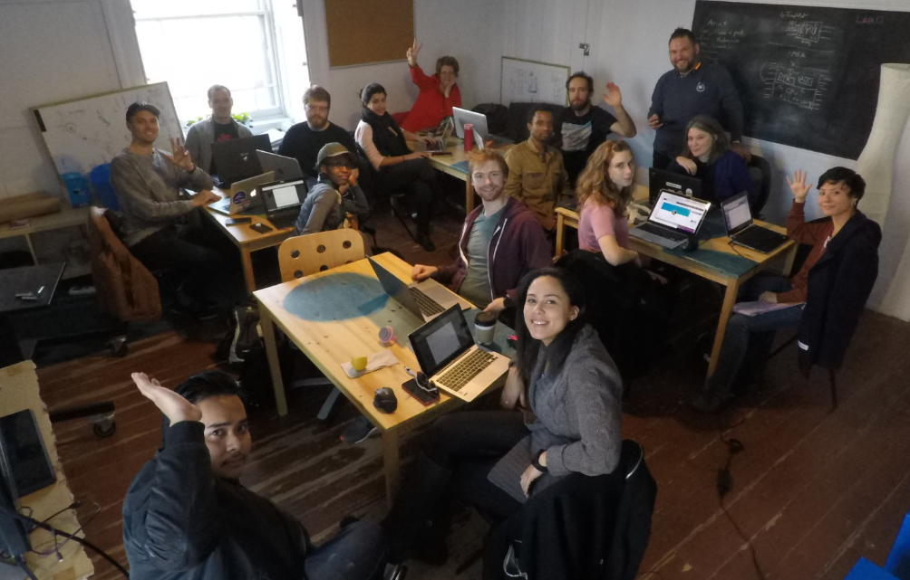
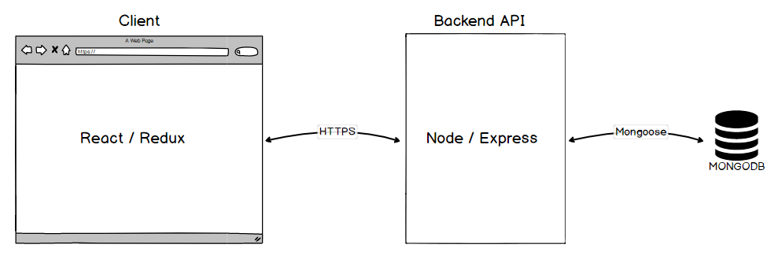
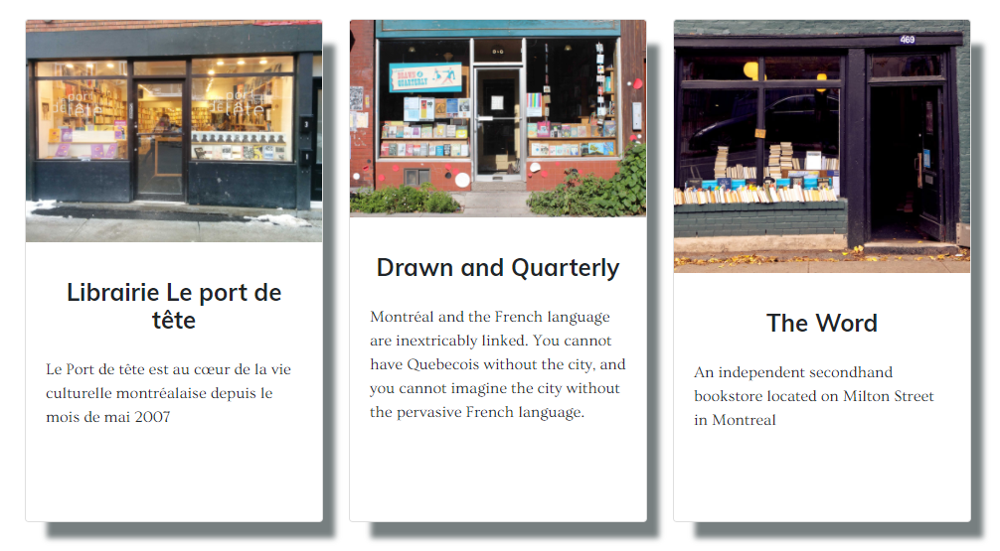

---
### Update

In an effort to simplify the project and encourage participation, I rebuilt The Travel Shelf with Gatsbyjs. Check out the live site [here](https://sharp-bose-ab73ce.netlify.com/) as well as the [source](https://github.com/VernL/p-gatsby-the-travel-shelf). 

Gatsbyjs is a modern site generator powered by GraphQL. You can thing of Gatsby as the love child between Jekyll and React, that was sent to the future and came back with super powers. It's strength is in building static sites with React components using virtually any type of data source. It's fun, it's fast, and you should [check it out](https://gatsbyjs.org).

The entire project is now self contained and can be hosted for free on Netlify. Also, using GraphQL queries removed the need for using Redux. The code bellow generates the cards for each post as well as display the most recent post on the front page.

```javascript

    <div>
      <section id="portfolio">
        <div className="container">
          <h2 className="text-center">Welcome To The Travel Shelf</h2>
          <hr align="center" width="30%" />
          <p className="text-center header">
            Browse Our Portfolio And Visit Your Local Independent Bookstores
            Today!
          </p>
          <div className="row no-gutters d-flex flex-wrap justify-content-around align-items-baseline">
            {allPosts.map(({ node }) => (
              <StoreCard
                key={node.frontmatter.title}
                slug={node.fields.slug}
                title={node.frontmatter.title}
                excerpt={node.excerpt}
                thumbnail={node.frontmatter.thumbnail.childImageSharp.sizes}
              />
            ))}
          </div>
        </div>
      </section>

      <section id="featuredPost">
        <div className="container">
          <h2 className="text-center">Featured Bookstore</h2>
          <hr align="center" width="30%" />
          <h1 className="text-center">{latestPost.frontmatter.title}</h1>
          <article className="post">
            <div
              dangerouslySetInnerHTML={{
                __html: latestPost.html
              }}
            />
          </article>
        </div>
      </section>
    </div>

export default IndexPage;

export const query = graphql`
  query IndexQuery {
    allMarkdownRemark(sort: { fields: [frontmatter___date], order: DESC }) {
      edges {
        node {
          id
          html
          frontmatter {
            title
            date(formatString: "YYYY-MM-DD")
            thumbnail {
              childImageSharp {
                sizes(maxWidth: 400) {
                  ...GatsbyImageSharpSizes
                }
              }
            }
          }
          fields {
            slug
          }
          excerpt
        }
      }
    }
    latestPost: allMarkdownRemark(
      sort: { fields: [frontmatter___date], order: DESC }
      limit: 1
    ) {
      edges {
        node {
          html
          frontmatter {
            title
          }
        }
      }
    }
  }
`;

```

---

In fall 2017, I joined the [LAB12](https://www.pitonneux.org/lab12/) self directed learning program. The program's main focus was to collaborate with a team and build a project. Along with a ton of programming experience, I learned agile development workflows and how to use github effectively. LAB12 was a lot of fun and I highly recommend it to anyone looking to level up their coding skills. Just be prepared to put in long hours to get your team across the finish line.



[The Travel Shelf](http://www.thetravelshelf.com) was born out of the LAB12 program. It's an open source project aiming to promote independent bookstores around the world. I worked on every aspect of the project including coding for the frontend and backend, creating user stories and managing the team. We created a single page application written in JavaScript using React with Redux on the frontend and a Node/Express backend. An overview of the project is shown in the diagram below.



Bookstore data was modeled using Mongoose and stored in a MongoDB database hosted on [mlab](https://mlab.com/). The backend API exposes a series of endpoints to communicate with the client:

```javascript
const express = require('express')
const router = express.Router()
const db = require('../models')

router.get('/', function (req, res, next) {
  db.Bookstore.find()
    .then(stores => res.json(stores))
    .catch(err => console.log(err))
})

router.get('/:name', function (req, res, next) {
  db.Bookstore.findOne({name: req.params.name})
    .then(store => res.json(store))
    .catch(err => console.log(err))
})

router.post('/', function (req, res, next) {
  let newStore = new db.Bookstore({...req.body})
  res.sendStatus(200)
  newStore.save()
    .then(() => console.log('Store successfully added to database'))
    .catch(err => console.log(err))
})

module.exports = router
```

On the client side, the redux thunk middleware was used to dispatch asynchronous actions and load data into the Redux store:

```javascript
import * as actionTypes from './actionTypes'

export const setStores = (stores) => {
  return {
    type: actionTypes.SET_STORES,
    stores: stores
  }
}

export const setSelectedStore = (store) => {
  return {
    type: actionTypes.SET_SELECTED_STORE,
    store: store
  }
}

export const selectStore = (name) => {
  return dispatch => {
    fetch('/api/bookstores/' + name)
      .then(res => {
        if (!res.ok) {
          throw Error(res.status)
        } else {
          return res.json()
        }
      })
      .then(store => dispatch(setSelectedStore(store)))
      .catch(error => console.log('Error Fetching Stores', error))
  }
}

export const fetchStores = () => {
  return dispatch => {
    fetch('/api/bookstores')
      .then(res => {
        if (!res.ok) {
          throw Error(res.status)
        } else {
          return res.json()
        }
      })
      .then(stores => dispatch(setStores(stores)))
      .catch(error => console.log('Error Fetching Stores', error))
  }
}
```

From the Redux store, data is shared across the application and used to render components dynamically. The code snippet below shows the process of retrieving and mapping through data to generate cards on the index page:

```javascript
import ...

class StoreIndex extends Component {

  storeSelectHandler = (name) => {
    this.props.history.push({pathname: this.props.match.url + '/' + name})
  }

  render () {
    let stores = null

    if(this.props.stores){
      stores =  this.props.stores.map(store => (
            <StoreCard
              key={store.name}
              {...store}
              clicked={() => this.storeSelectHandler(store.name)}
            />
        )
      )
    }

    return (
        <section>
          <div className='row justify-content-center'>
            <div className='col d-flex flex-wrap justify-content-around'>
              {stores}
            </div>
            </div>
        </section>
    )
  }
}

const mapStateToProps = state => {
  return {
    stores: state.stores
  }
}

export default connect(mapStateToProps) (StoreIndex)
```

This is what it looks like in the browser:



The repository for the project is available [here](https://github.com/RichardLitt/the-travel-shelf). It's an open source project so feel free to browse, fork or contribute!
