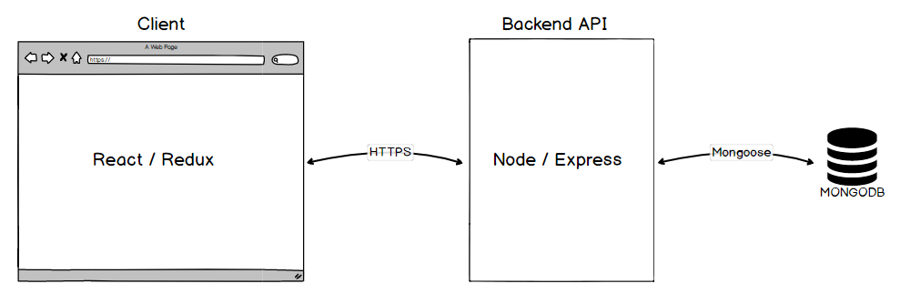
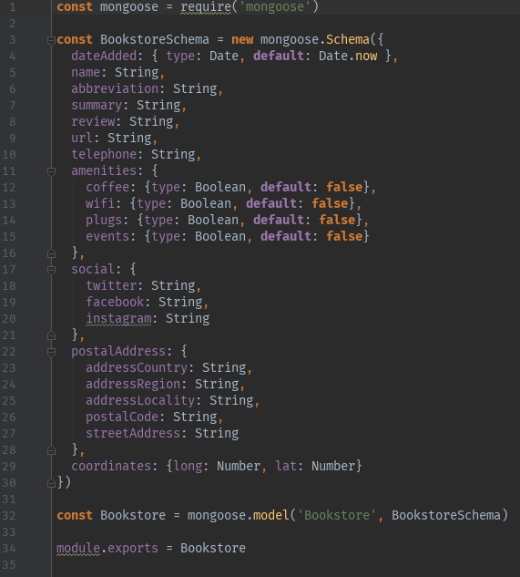
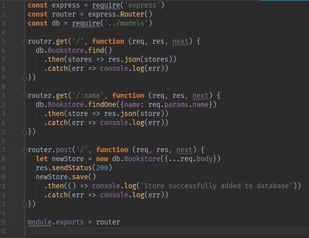
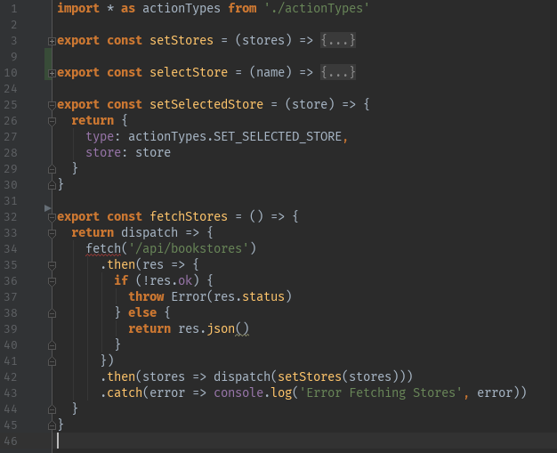
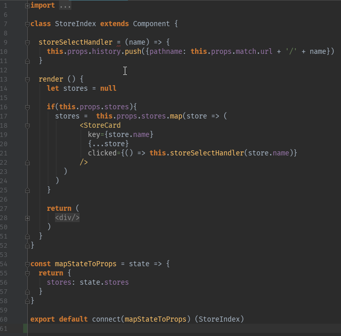

# The Travel Shelf

[The Travel Shelf](www.thetravelshelf.com) is an open source project created to promote independent bookstores around the world. It was developed as part of the [LAB12](https://www.pitonneux.org/lab12/) self directed learning program by a team of students. I worked on both the front and back ends of the project. It was written in JavaScript and uses a React with Redux frontend powered by a Node/Express backend API. An overview of the project is shown in the following diagram:

Bookstore data is stored in a MongoDB database using the following schema:

The backebd API exposes a series of endpoints to communicate with the client:

The redux thunk middelware is used to dispatch asynchronous actions and fetch data from the backend:

Data is shared accross the applications state with redux and components are rendered dynamically by mapping through data. For example, the code snippet below shows the cards being generated to list entries on the store index page:

The site was launched in early 2018 and is available [here](www.thetravelshelf.com).
